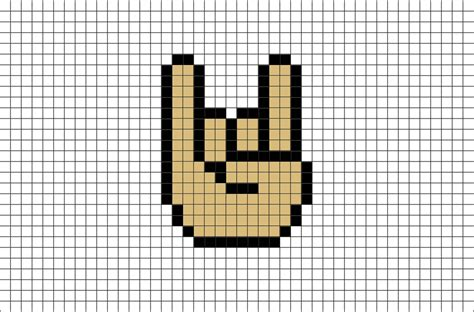

<!-- PROJECT LOGO -->
<br />
<p align="center">
  

  <h3 align="center">Photo To Pixels</h3>

  <p align="center">
   Transform an image into a dataset of pixels
  </p>
</p>

<!-- ABOUT THE PROJECT -->

## About The Project

<!-- Add demo here!! -->

Apart of my NSF Research project, I was tasked with taking 50x50 images and creating a dataset of pixels.
For each image, I had to create 25 10x10 patches, then add the rgb values for each pixel in the 10x10 to
an excel sheet. In a seperate program, I attached turbidity values to the end of each row of data.

### Built With

- [Pillow](https://python-pillow.org/)
- [Pandas](https://pandas.pydata.org/)

<!-- GETTING STARTED -->

## Getting Started

### Prerequisites

- python3.8

  ```sh
  sudo apt update
  sudo apt install software-properties-common
  sudo add-apt-repository ppa:deadsnakes/ppa
  sudo apt install python3.8
  ```

- pip3
  ```sh
  sudo apt install python3-pip
  ```

### Installation

2. Clone the repo
   ```sh
   git clone https://github.com/michaelnavs/pixelize.git
   ```
3. Create virtual environment
   ```sh
   python3 -m venv venv
   ```
4. Activate virtual environmnt
   ```sh
   source venv/bin/activate
   ```
5. Install required packages
   ```sh
   pip install -r requirements.txt
   ```
6. cd in server
   ```sh
   cd server
   ```
7. Start development server
   ```
   python main.py
   ```
